# Bally/Sente SAC-I core for MiSTer

A MiSTer FPGA core for Bally/Sente's SAC-I arcade hardware (MAME's
`bally/balsente.cpp`), built with Quartus Prime 17.0.2 Lite for the DE10-nano.

## Contents

- [History](#history)
- [Games](#games)
  - [Supported](#supported)
  - [Out of scope for now](#out-of-scope-for-now)
- [Hardware](#hardware)
  - [Video timing](#video-timing)
- [Screenshots](#screenshots)
- [Installation](#installation)
- [Controls](#controls)
- [Status](#status)
  - [Features](#features)
  - [Todo](#todo)
  - [Resource usage](#resource-usage)
- [AI Attestation](#ai-attestation)
- [Verification](#verification)
- [Acknowledgements](#acknowledgements)
- [Layout](#layout)
- [License](#license)

## History

**BallySente_20260927.rbf**
- Adds Team Hat Trick, Grudge Match, Spiker, Rescue Raider, Stompin' and Night Stocker.

**BallySente_20260926.rbf**
- Beta release
- Chicken Shift and Snacks 'n Jackson working at least. Other games YMMV.

## Games

The core targets the SAC-I cartridge platform: one main board (MC6809E, 256×240 bitmap, 40
sprites) and the 6VB sound board (Z80, six CEM3394 voices). MAME lists 41 sets; 39 are on SAC-I
hardware and in scope. All ROMs are held in block RAM, so no SDRAM module is needed.

### Supported

Sets with an `.mra` in `releases/` (clones in `releases/_alternatives/_<parent>/`). Chicken Shift and Snacks'n Jaxson run well enough. Others have not been tried much yet though many appear to play okay.

| Name | Year | Manufacturer | Controls | Notes |
|-|-|-|-|-|
| Chicken Shift (11/23/84) | 1984 | Bally/Sente | two buttons | plays on a DE10-nano, with sound |
| Gimme A Break (7/7/85) | 1985 | Bally/Sente | trackball, one button, two players | |
| Goalie Ghost | 1984 | Bally/Sente | trackball, two buttons, two players | |
| Hat Trick (11/12/84) | 1984 | Bally/Sente | joystick, one button, two players | |
| Mini Golf (set 1; 11/25/85; 10/8/85; cocktail, 10/18/85) | 1985 | Bally/Sente | trackball, one button; Start 1-4 pick the players | the cocktail set has a trackball each side |
| Name That Tune (Bally, 3/31/86; 3/23/86) | 1986 | Bally/Sente | four buttons, two players | |
| Off the Wall (Sente) (10/16/84) | 1984 | Bally/Sente | dial, two players | |
| Snacks'n Jaxson | 1984 | Bally/Sente | trackball, one button | plays on a DE10-nano with the d-pad |
| Snake Pit (and 9/14/84) | 1984 | Bally/Sente | trackball, one button | |
| Stocker (3/19/85) | 1984 | Bally/Sente | steering wheel (a dial), one button | |
| Street Football (11/12/86) | 1986 | Bally/Sente | analog stick, one button, two players | |
| Toggle (prototype) | 1985 | Bally/Sente | joystick, one button, two players | |
| Trivial Pursuit (Genus 2/12/85 and 12/14/84; Baby Boomer; Genus II; Young Players; All Star Sports; Volumen II and III, Spanish) | 1984-1987 | Bally/Sente | joystick, two buttons; Start 1-4 pick the players | |
| Sente Diagnostic Cartridge | 1984 | Bally/Sente | joystick, one button, trackball | the board's own self-test |
| Team Hat Trick (11/16/84) | 1984 | Bally/Sente | joystick, one button, four players | players 3 and 4 on the third and fourth controllers |
| Grudge Match (v00.90; Italy; v00.80) | 1987 | Bally/Sente | steering wheel, one button, three players | wheels from the mouse, spinners, d-pads or sticks |
| Spiker (6/9/86; 5/5/86; earliest) | 1986 | Bally/Sente | trackball, one button, two players | |
| Rescue Raider (5/11/87 and stand-alone) | 1987 | Bally/Sente | two joysticks, one button | the right stick, or R Right/Left/Down/Up |
| Stompin' (4/4/86 and prototype) | 1986 | Bally/Sente | eight foot pads, one button | the pads are the d-pad's eight directions |
| Night Stocker (10/6/86 and 8/27/86) | 1986 | Bally/Sente | light gun, dial, one button | gun from the mouse, d-pad or left stick, with a crosshair |
| Shrike Avenger (prototype) | 1986 | Bally/Sente | flight stick, four buttons | a second board with a 68000; Start presses both seat buttons |

### Out of scope for now

| MAME description | Why |
|-|-|
| Trivial Pursuit (Volumen IV / Volumen V, Spanish, Maibesa hardware) (`triviaes4`, `triviaes5`) | different Maibesa hardware (MC6845 CRTC, Z80 with 2×AY8910 and MSM5205), and MAME marks both `MACHINE_NOT_WORKING` |

## Hardware

| Chip | Function | Status |
|-|-|-|
| MC6809E @ 1.25 MHz | main CPU | vendored: Greg Miller's `mc6809i`, jotego's clock-enable fork; checked against MAME's bus trace |
| Z80 @ 4 MHz | 6VB sound CPU | vendored: MiSTer-devel T80, unchanged; checked against MAME's bus trace |
| MC6850 ACIA ×2 | the serial link between the boards | written here, transcribed from MAME's `6850acia.cpp` |
| 8253 PIT | 6VB timing and the oscillator measurement | written here, transcribed from MAME's `pit8253.cpp`; modes 0 and 1 only (all the boot uses) |
| CEM3394 ×6 | synthesiser voices: oscillator, 4-pole filter, mixer, VCA | written here from MAME's numerical model, in fixed point; one oscillator, one filter and one coefficient unit time-shared over the six voices |
| MM5837 | noise source into every voice | written here, from MAME's `mm5837` |
| X2212 ×2 | NOVRAM (system and cartridge) | written here; SRAM only, saved to the `.nvm` file |
| main board logic | address decode, bank mapper, palette bank, random number source, interrupt timer | written here from `balsente.cpp` and `balsente_m.cpp` |
| video | 4bpp bitmap and a line-buffered sprite engine, racing the beam as the board does | written here from `balsente_v.cpp`, checked against a beam-accurate model |

### Audio

The sound uses analog synthesis, not samples. The 6VB board carries six Curtis CEM3394 "synthesiser
voice" chips, each a complete monophonic voice: a voltage-controlled oscillator (sawtooth,
triangle and pulse, with pulse width), a mixer that blends it with an external input, a
four-pole low-pass filter with resonance and oscillator-driven filter modulation, and an output
VCA. Each chip has eight control voltages (pitch, final gain, resonance, cutoff, mixer balance,
modulation depth, pulse width, waveform). The board's Z80 sets them all through one 12-bit DAC:
it writes a DAC value, selects a register and strobes the chips that should latch it. An MM5837
noise source feeds every voice's external input. At power-on the Z80 calibrates every voice,
timing each oscillator with an 8253 counter at several settings before playing anything; that is
the ~9.5 s of silence after boot. The main board sends sound commands to the Z80 over a 6850
serial link.

The core models the chips from MAME's numerical CEM3394 model, in fixed point at 96 kHz. It
computes 2^x, tan and reciprocals from small tables with polynomial and Newton refinement, and
avoids aliasing with polyBLEP/polyBLAMP corrections on the waveform edges. The filter's saturation
is a tanh lookup. One oscillator, one coefficient unit and one filter are time-shared across all
six voices. `scripts/sente6vb_audio.py` is the integer specification: it matches MAME's recorded
Chicken Shift audio in level to 0.01 dB and in every octave band to 0.2 dB, and the RTL matches it
bit for bit when fed MAME's recorded control writes. The mix is raised 18 dB over MAME's level,
which is too quiet for a MiSTer (`docs/HACKS.md`).

### Video timing

5 MHz dot clock (20 MHz / 4), 320 dots per line and 264 lines per frame: 15.625 kHz lines and a
59.19 Hz frame. The visible area is 256×240. The numbers are MAME's `set_raw()` for the driver;
there is no PCB measurement. The core runs on a 40 MHz clock with a 1-in-8 pixel enable.

## Screenshots

### Chicken Shift

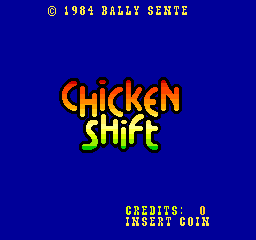
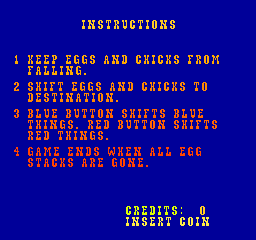
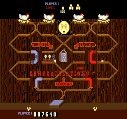
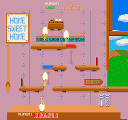

### Gimme A Break

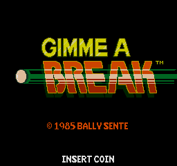
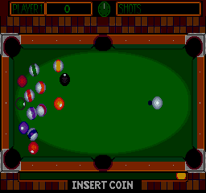

### Goalie Ghost

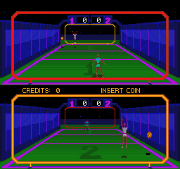

### Hat Trick

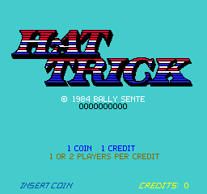
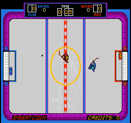

### Mini Golf

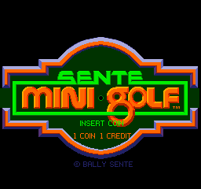
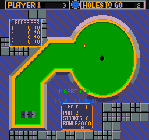

### Name That Tune

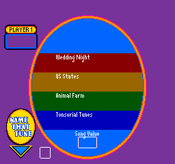
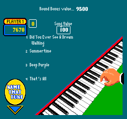

### Off the Wall

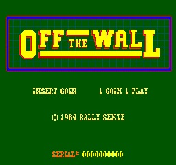
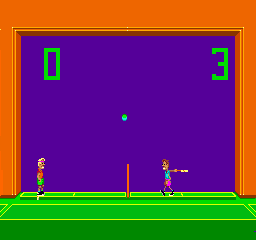

### Snacks'n Jaxson

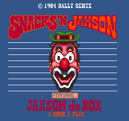
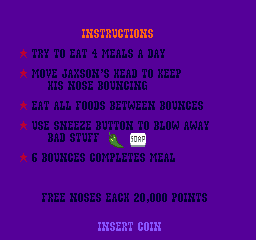
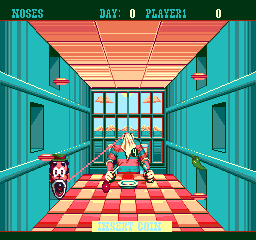

### Snake Pit

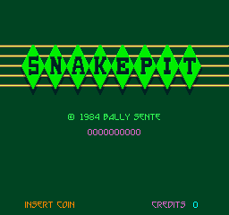
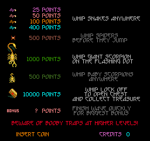
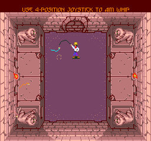

### Stocker

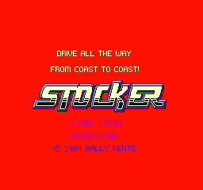
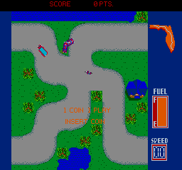

### Street Football

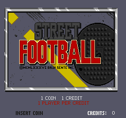
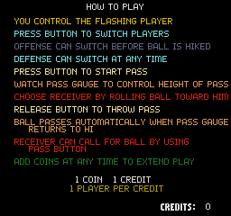
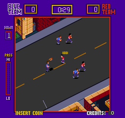

### Toggle

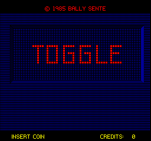
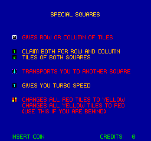
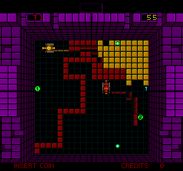

### Trivial Pursuit (Genus Edition)

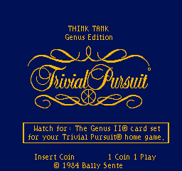

## Installation

No SDRAM module is needed.

Copy `releases/Arcade-BallySente_20260927.rbf` to `_Arcade/cores` and `releases/*.mra` (with
`_alternatives/`) to `_Arcade/_BallySente`. To run a development build instead:
`python scripts/build_staged.py`, then `python scripts/deploy.py` with a `mister.env` (see
`scripts/deploy.py`). That copies the core to `_Arcade/cores` and the `.mra` files to
`_Arcade/_BallySente`, clones in `_alternatives/_<parent>/` beneath it.

* Put the MAME merged or split ROM sets in `games/mame`, and `sente6vb.zip` beside them: the 6VB
  sound board's ROM is a device ROM every set needs

## Controls

- Keyboard, MAME's defaults: arrows / R F D G, buttons LCtrl LAlt Space LShift / A S Q W,
  Start 1 / 2, Coin 5 / 6; F2 service, P pause. The keys act wherever the d-pad does (trackballs,
  dials, the gun).
- **Pause** freezes both CPUs; the OSD can also pause while it is open.
- **Start 3** and **Start 4** are on the first controller, for the sets that pick the number of
  players on one panel (Trivial Pursuit, Mini Golf).
- Trackballs and dials: player 1's from the mouse; any player's from its controller's d-pad (at
  half the speed of MAME's default keys) or left analog stick, moving at a rate set by how far it is pushed;
  dials also from the spinner. Street
  Football's and Shrike Avenger's sticks are the controllers' left analog sticks, or the d-pad as
  MAME's keys drive them (20 a frame, re-centring when released).
- Night Stocker's gun: the mouse (left button is also the trigger), the d-pad (two units a
  frame) or the left stick (aims directly; OSD "Gun stick": Auto, Aim, D-pad, as the Seta core's
  Zombie Raid). Its dial is the spinner or the right stick's left/right. OSD "Crosshair" hides the crosshair.
- Grudge Match's wheels: player 1's from the mouse; each player's from its spinner, d-pad or
  left stick.
- Stompin's eight pads are the d-pad's eight directions.
- Team Hat Trick and Grudge Match take players 3 and 4 from the third and fourth controllers.

## Status

Known issues:

- **The first ~9.5 s after boot are silent** by design: the sound program mutes its voices while
  it calibrates them. MAME plays that calibration (`docs/MAME_KLUDGES.md`).
- Flip screen is the core's own (the board has none) and approximates two things on moving
  pictures (`docs/HACKS.md`).

`docs/MAME_KLUDGES.md` lists what is taken from MAME as behaviour and what is known not to be
right. `docs/HACKS.md` lists this core's own approximations. `docs/ROADMAP.md` is the plan and its
progress; `docs/LESSONS_LEARNED.md` is what it cost.

### Features

* CRT Adjust (H-Position, V-Shift, H-Size, V-Size): not yet
* HDMI scaling (integer scale, crop, crop offset): done
* HDMI rotation (orientation): done, confirmed on hardware
* Flip screen, HDMI and analog, from the OSD or the DIP (fake DIP where the game has none): done
  (a fake DIP: no set has a flip)
* HDMI-only options hidden under direct video: done
* Peripheral menus shown only for games that use them: done -- the gun page appears only for Night Stocker
* Light guns: mouse, analog stick and synthetic crosshair, where used: done (Night Stocker),
  not yet tried on hardware
* Audio mix (Mono, None, 25%, 50%): done
* Hiscore saving (`hiscore.v`, with autosave): n/a — the games keep their own tables in NOVRAM,
  saved below
* NVRAM / EEPROM saved to the `.nvm` file: in the core, not yet confirmed on hardware
* Pause (with CPU suspended): done
* Savestates (optional): not yet
* Cheats (optional): not yet

### Todo

- [ ] Try the analog-control sets on hardware
- [ ] Try Team Hat Trick, Grudge Match, Spiker, Rescue Raider, Stompin' and Night Stocker on hardware
- [ ] CRT Adjust

### Resource usage

Release 20260927 (commit d8397c2, seed 2), revision `BallySente`, on the DE10-nano's Cyclone V
5CSEBA6, speed grade 7, `clk_sys` setup slack +2.856 ns at 40 MHz; every clock positive, worst
setup +0.692 ns (HDMI PLL), worst hold +0.227 ns:

| resource | used | available |
| --- | --- | --- |
| Logic (ALMs) | 26,189 | 41,910 |
| Block memory bits | 3,913,023 | 5,662,720 |
| RAM blocks | 501 | 553 |
| DSP blocks | 92 | 112 |
| PLLs | 3 | 6 |

RAM blocks are the resource to watch: the program ROM alone takes 256 of them.

## AI Attestation

This core is being developed with heavy use of a frontier coding assistant, which wrote the RTL,
the testbenches, the tooling and these documents under the author's direction. The author tests
it on hardware.

## Verification

Not PCB-validated. MAME is the accuracy reference, with its own acknowledged uncertainties noted
where they matter.

* **Main CPU:** 400,000 bus cycles of `sentetst` from reset against MAME's trace; all 52,232
  writes identical in address, data and order.
* **Sound CPU:** 1,200,000 bus accesses against MAME's trace; all reads and writes identical in
  address and data (one instruction orders its two writes differently, noted in
  `MAME_KLUDGES.md`).
* **Whole machine:** Chicken Shift from its own ROMs, loaded through the download path with the
  `.mra`'s DIPs: video RAM, palette and sprite list byte-identical to MAME's at frames 900 and
  1200.
* **Video:** six MAME beam captures against a beam-accurate model, 0 differing pixels each. Flip
  screen on the same six captures held still: equal to the unflipped frame turned 180 degrees,
  0 of 61,440 pixels each.
* **Sound calibration:** the 6VB's boot calibration against MAME's I/O trace; the voice, mode,
  control voltage and count match on every measurement.
* **Sound:** the fixed-point specification against MAME's Chicken Shift recording, 10 s
  in-game: level +0.01 dB, worst octave 0.20 dB, envelope correlation +0.9863 — the same
  figures as the floating-point model. The RTL against that specification, driven by MAME's
  recorded 6VB writes: 1,920,000 samples, 698,696 writes, 0 mismatches.
* **`.mra` files:** each one's ROM image byte-identical to the regions built from MAME's
  `ROM_START`.

## Acknowledgements

- **Sorgelig** and the **MiSTer-devel team** for the
  [Template_MiSTer](https://github.com/MiSTer-devel/Template_MiSTer) framework, and Sorgelig for
  `screen_rotate_two`.
- The **MAMEdev team** — Aaron Giles for `balsente.cpp` and the CEM3394, m1macrophage for the
  CEM3394's current model and the `va_*` primitives it is built from — for the driver and device
  emulations that are this core's specification.
- **Greg Miller** for the `mc6809i` 6809 core, and **jotego** for its clock-enable fork.
- **Daniel Wallner** and the MiSTer-devel maintainers for **T80**.
- **Jorge Cwik** for the **FX68K** 68000 core.
- **misteraddons**, whose Arcade-BallySenteSAC1_MiSTer core's Shrike Avenger board this core's is
  adapted from, and whose notes on its seat buttons it follows.

## Layout

Standard [Template_MiSTer](https://github.com/MiSTer-devel/Template_MiSTer) structure:

| path | contents |
| - | - |
| `sys` | MiSTer framework, vendored from the template, never edited |
| `rtl` | core source; vendored modules carry a `PROVENANCE.md` |
| `releases` | `.rbf` and `.mra` files; clones in `_alternatives/_<parent>` |
| `docs` | roadmap, workflow, release process, kludges, hacks, lessons |
| `sim` | ModelSim and Verilator testbenches |
| `scripts` | build, deploy, capture and verification tooling |
| `debug` | reference captures from MAME used as ground truth (gitignored) |
| `roms` | your own MAME sets (gitignored, never committed) |

## License

GPL-3.0 (see `LICENSE`). Imported components keep their own licences; each vendored module's
`PROVENANCE.md` has the detail and every modified vendored file states the change in its header.

Game ROMs contain copyrighted material and are not included. Obtaining them is your
responsibility.
